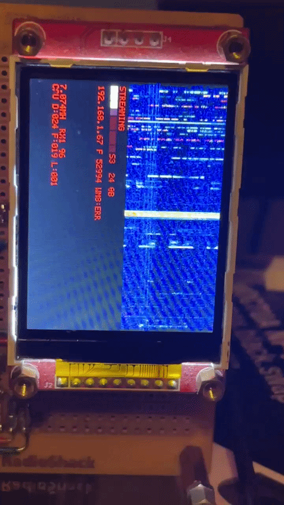

# HL2 Client on Teensy 4.1

Proof of concept client using the `hl2` crate from this repo to connect to Hermes Lite 2
and stream the waterfall to a ILI9341 base LCD over SPI and stream demodulated audio to
the WM8731 audio codec board.

* https://www.mikroe.com/audio-codec-proto-board

## Build

```
cargo objcopy --release -- -O ihex hl2.hex
```

Download `hl2.hex` to your Teensy 4.1 with Teensy Loader.

## Pins

Currently this teensy project interacts with three pieces of hardware. the Teensy ethernet
device with its own dedicated pins, the ILI9341 LCD display over SPI, and the WM8731 audio
codec board over I2C.

### ILI9341

LCD Output

```
//    SCK        13
//    MOSI       11
//    MISO       12
//    CS         10
//    DC          9
```

### WM8731

Audio Output

```
//    MikroE   Teensy 4
//    ------   --------
//     SCK        21
//     MISO        8
//     MOSI        7
//     ADCL       20
//     DACL       20
//     SDA        18
//     SCL        19
```

### Rotary Encoder

Used for tuning and mode switching

```
//   Encoder  Teensy 4
//   -------  --------
//    Pin1     28
//    Pin2     29
//    Btn      30
```


